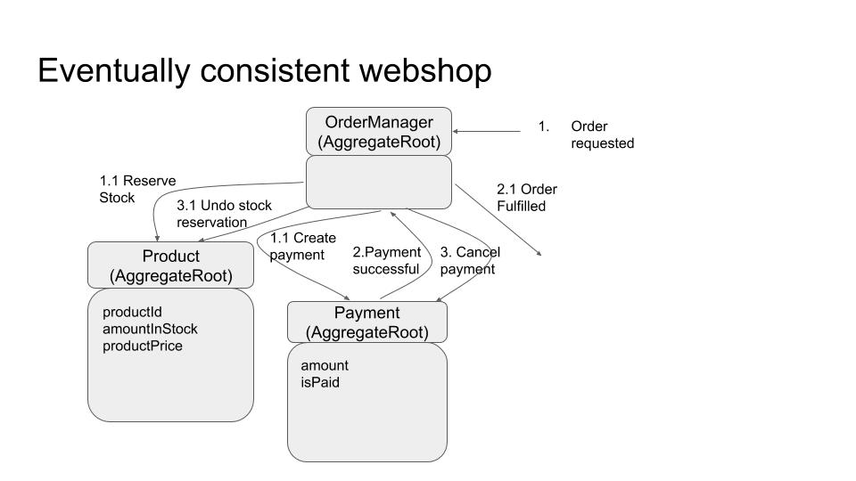

# Webshop hands-on

1. Finish OrderManager Saga. See the OrderManagerTest

2. Finish Payment Aggregate. See the PaymentTest (I did not succeed in getting the test running using the axon test fixture. It requires tweaking in the text fixture setup, I added one test just using plain mockito)

3. Implement Product aggregate and tests

See interaction model for overview of interactions:

   